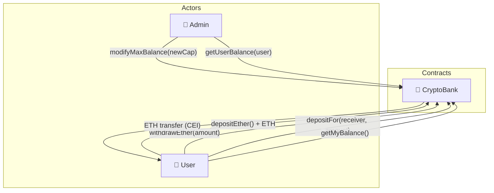

# 🏦 CryptoBank

[](https://github.com/noelialuz/CryptoBank)
[](https://soliditylang.org/)
[](https://www.gnu.org/licenses/lgpl-3.0.html)
[](https://ethereum.org/)

> **A minimal, multi-user on-chain bank where users deposit and withdraw native ETH under a configurable balance cap, with internal transfers and restricted balance reads.**

CryptoBank is a learning-oriented Solidity smart contract that simulates a simple crypto bank on the Ethereum Virtual Machine (EVM). Multiple users can deposit native **ETH**, withdraw only what they previously deposited, transfer part of their balance to another user, and stay within a **maximum balance per user** enforced by the contract.

The **admin** can update the max balance cap and query any user's balance. Regular users can only read their own balance through dedicated view functions — the `userBalances` mapping is **private**, so there is no public auto-getter for arbitrary addresses.

**Key features:**

- 👥 Multi-user private `userBalances` mapping with per-address accounting
- 💰 Payable `depositEther()` for native ETH deposits
- 🔐 Self-custody withdrawals with **Checks-Effects-Interactions (CEI)** on `withdrawEther()`
- 🤝 Internal balance transfer via `depositFor()` between distinct users
- 📊 Configurable per-user cap via `maxBalance` (admin-updatable)
- 🛡️ `onlyAdmin` modifier on `modifyMaxBalance()` and `getUserBalance()`
- 👁️ Users call `getMyBalance()`; admin uses `getUserBalance(address)`
- 📣 Events: `EtherDeposit`, `EtherWithdraw`, `EtherDepositFor`

---

## 📋 Table of Contents

1. [Prerequisites & Dependencies](#-prerequisites--dependencies)
2. [Technologies & Versions](#-technologies--versions)
3. [Project Structure](#-project-structure)
4. [Quick Start](#-quick-start)
5. [Testing the Contract](#-testing-the-contract)
6. [Architecture](#-architecture)
7. [Security Policy](#-security-policy)
8. [Scripts & Commands](#-scripts--commands)
9. [Versioning](#-versioning)
10. [License](#-license)
11. [About the Author](#-about-the-author)

---

## 📦 Prerequisites & Dependencies

### System requirements

| Requirement | Notes |
| :-- | :-- |
| 🖥️ **OS** | macOS, Linux, or Windows |
| 🌐 **Browser** | Modern browser for [Remix IDE](https://remix.ethereum.org/) (recommended workflow) |
| 🔧 **Git** | Required for cloning the repository |
| 💼 **Wallet** (optional) | MetaMask or similar for testnet/mainnet deployment |

**Quick minimum:** a modern browser + [Remix IDE](https://remix.ethereum.org/) + Solidity compiler **0.8.24**.

### Optional tooling

| Tool | Purpose |
| :-- | :-- |
| [Foundry](https://getfoundry.sh/) (`forge`, `cast`, `anvil`) | CLI testing, scripting, and local node |
| [Hardhat](https://hardhat.org/) | Node.js-based testing and deployment |

Install Foundry (optional):

```bash
curl -L https://foundry.paradigm.xyz | bash
foundryup
```

Verify:

```bash
forge --version
cast --version
```

---

## 🛠 Technologies & Versions

| Technology | Version | Role |
| :-- | :-- | :-- |
| **Solidity** | `^0.8.24` | Smart contract language |
| **EVM** | — | Execution environment (Ethereum-compatible chains) |
| **Remix IDE** | — | Compile, deploy, and interact (primary workflow) |
| **Git / GitHub** | — | Version control and hosting |
| **SPDX** | `LGPL-3.0-only` | License identifier in source |

---

## 📁 Project Structure

```bash
CryptoBank/
├── CryptoBank.sol          # Main bank contract: deposits, withdrawals, transfers, admin
├── README.md               # Project documentation
├── .gitignore              # Ignores Remix artifacts, deps/, and .env files
└── .vscode/                # Editor settings (optional)
```

This repository is a **single-file, Remix-ready** contract. There is no Foundry/Hardhat scaffold included by default — add your preferred toolchain locally if you want automated tests or deployment scripts.

---

## 🚀 Quick Start

### 1. Clone the repository

```bash
git clone https://github.com/noelialuz/CryptoBank.git
cd CryptoBank
```

### 2. Open in Remix

1. Go to [Remix IDE](https://remix.ethereum.org/).
2. Import or upload [`CryptoBank.sol`](./CryptoBank.sol).
3. Compile with Solidity **0.8.24** (or compatible `^0.8.24`).

### 3. Deploy

In **Deploy & Run Transactions**:

| Field | Value |
| :-- | :-- |
| **Contract** | `CryptoBank` |
| **`maxBalance_`** | e.g. `5000000000000000000` (5 ETH in wei) |
| **`_admin`** | Admin wallet address (e.g. Remix Account #0) |

Deploy and copy the contract address for interaction and testing.

### Usage overview

```solidity
// 1. Deploy CryptoBank with maxBalance and admin address.
// 2. Users call depositEther() with ETH to credit their internal balance.
// 3. Users call withdrawEther(amount) to receive ETH back (CEI pattern).
// 4. Users call depositFor(receiver, amount) to move internal balance to another user.
// 5. Admin calls modifyMaxBalance(newCap) and getUserBalance(user).
```

Example balance check after deposit:

```solidity
// User deposits 1 ETH, then reads own balance
bank.depositEther{value: 1 ether}();
// getMyBalance() → 1000000000000000000
```

---

## 🧪 Testing the Contract

Use **Account 0** as admin and **Account 1** / **Account 2** as users in Remix.

> **Note:** `userBalances` is private. Use `getMyBalance()` or `getUserBalance(address)` — do not look for a public `userBalances` button in Remix.

### 1. Deposit ETH (`depositEther`)

| Step | Action |
| :-- | :-- |
| 1 | Select **Account 1** |
| 2 | Set **Value** to `1 ether` |
| 3 | Call `depositEther()` |
| 4 | Call `getMyBalance()` → should return `1000000000000000000` |

Repeat until `maxBalance`; the next deposit should revert with `"Max balance reached"`.

### 2. Withdraw ETH (`withdrawEther`)

| Step | Action |
| :-- | :-- |
| 1 | Stay on **Account 1** |
| 2 | Call `withdrawEther` with `amount_` = `500000000000000000` (0.5 ETH) |
| 3 | Call `getMyBalance()` → balance should decrease |
| 4 | Account 1 wallet ETH should increase |

Withdrawing more than balance → `"Not enough ether"`.

### 3. Transfer balance to another user (`depositFor`)

| Step | Action |
| :-- | :-- |
| 1 | **Account 1** deposits e.g. `2 ether` via `depositEther()` |
| 2 | **Account 1** calls `depositFor(Account2Address, 1000000000000000000)` (1 ETH) |
| 3 | **Account 1** → `getMyBalance()` → `1000000000000000000` |
| 4 | Switch to **Account 0** (admin) → `getUserBalance(Account2Address)` → `1000000000000000000` |

Edge cases to try:

- Same sender and receiver → `"You cannot deposit for yourself"`
- `amount_` of zero → `"Amount must be greater than 0"`
- `amount_` greater than sender balance → `"Not enough ether"`
- Transfer that would exceed receiver `maxBalance` → `"Max balance reached"`

### 4. Read balances (access control)

| Caller | Function | Result |
| :-- | :-- | :-- |
| Any user | `getMyBalance()` | Own balance only |
| Admin | `getUserBalance(anyAddress)` | Any user's balance |
| Non-admin | `getUserBalance(other)` | Reverts `"Not allowed"` |

### 5. Admin — change cap (`modifyMaxBalance`)

| Step | Action |
| :-- | :-- |
| 1 | **Account 0** (admin) |
| 2 | `modifyMaxBalance(10000000000000000000)` (10 ETH) |
| 3 | `maxBalance()` → updated value |

Non-admin call → `"Not allowed"`.

### 6. Events

Confirm in Remix **Transactions**:

- `EtherDeposit` on `depositEther`
- `EtherWithdraw` on `withdrawEther`
- `EtherDepositFor` on `depositFor`

### Option B — Foundry `cast` (CLI, after deploy)

```bash
# Deposit 1 ETH
cast send 0xYourContractAddress "depositEther()" --value 1ether --private-key $USER_PK

# Read own balance
cast call 0xYourContractAddress "getMyBalance()(uint256)" --from $USER_ADDRESS

# Admin: read any user balance
cast call 0xYourContractAddress "getUserBalance(address)(uint256)" 0xUserAddress --from $ADMIN_ADDRESS

# Withdraw 0.5 ETH
cast send 0xYourContractAddress "withdrawEther(uint256)" 500000000000000000 --private-key $USER_PK

# Internal transfer 0.25 ETH to another user
cast send 0xYourContractAddress "depositFor(address,uint256)" 0xReceiverAddress 250000000000000000 --private-key $USER_PK

# Admin: set max balance to 10 ETH
cast send 0xYourContractAddress "modifyMaxBalance(uint256)" 10000000000000000000 --private-key $ADMIN_PK
```

### Option C — Example Foundry test (local setup)

To run automated tests, initialize Foundry in a separate directory or fork this repo locally, copy `CryptoBank.sol` into `src/`, install `forge-std`, and add a test file:

```solidity
// SPDX-License-Identifier: LGPL-3.0-only
pragma solidity ^0.8.24;

import "forge-std/Test.sol";
import "../CryptoBank.sol";

contract CryptoBankTest is Test {
    CryptoBank bank;
    address admin = address(0xA11CE);
    address user = address(0xB0B);
    address user2 = address(0xC0C);

    function setUp() public {
        bank = new CryptoBank(5 ether, admin);
        vm.deal(user, 10 ether);
        vm.deal(user2, 1 ether);
    }

    function test_DepositWithdrawAndGetBalance() public {
        vm.prank(user);
        bank.depositEther{value: 2 ether}();
        assertEq(bank.getMyBalance(), 2 ether);

        vm.prank(user);
        bank.withdrawEther(1 ether);
        assertEq(bank.getMyBalance(), 1 ether);
    }

    function test_DepositFor() public {
        vm.prank(user);
        bank.depositEther{value: 2 ether}();

        vm.prank(user);
        bank.depositFor(user2, 1 ether);

        assertEq(bank.getMyBalance(), 1 ether);
        assertEq(bank.getUserBalance(user2), 1 ether);
    }

    function test_OnlyAdminCanReadOtherBalance() public {
        vm.prank(user);
        bank.depositEther{value: 1 ether}();

        vm.prank(admin);
        assertEq(bank.getUserBalance(user), 1 ether);

        vm.expectRevert("Not allowed");
        vm.prank(user2);
        bank.getUserBalance(user);
    }
}
```

Run with:

```bash
forge test -vv
```

---

## 🗄 Architecture

CryptoBank consists of a single contract with two actor roles:



### Contract responsibilities

| Contract | Responsibility |
| :-- | :-- |
| **`CryptoBank`** | Multi-user ETH vault with deposits, withdrawals, internal transfers, balance cap, and admin controls |

### Core state

| Variable | Visibility | Description |
| :-- | :-- | :-- |
| `maxBalance` | `public` | Maximum ETH a single user may hold in the bank |
| `admin` | `public` | Address allowed to change `maxBalance` and read any balance |
| `userBalances` | `private` | ETH credited per user (no public getter) |

### Write functions

| Function | Access | Description |
| :-- | :-- | :-- |
| `depositEther()` | `external payable` | Adds `msg.value` to caller balance if under cap |
| `withdrawEther(uint256 amount_)` | `external` | Withdraws ETH to caller using CEI |
| `depositFor(address receiver_, uint256 amount_)` | `external payable` | Moves `amount_` from caller's bank balance to `receiver_` |
| `modifyMaxBalance(uint256 newMaxBalance_)` | `onlyAdmin` | Updates the per-user balance cap |

### View functions

| Function | Access | Description |
| :-- | :-- | :-- |
| `getMyBalance()` | any user | Returns `userBalances[msg.sender]` |
| `getUserBalance(address user_)` | `onlyAdmin` | Returns balance of any `user_` |

### Events

```solidity
event EtherDeposit(address user_, uint256 etherAmount_);
event EtherWithdraw(address user_, uint256 etherAmount_);
event EtherDepositFor(address sender_, address receiver_, uint256 etherAmount_);
```

### User flow

1. **Deposit** — User sends ETH via `depositEther()`; balance increases up to `maxBalance`.
2. **Withdraw** — User calls `withdrawEther(amount)`; contract validates, updates mapping, then transfers ETH (CEI).
3. **Internal transfer** — User calls `depositFor(receiver, amount)` to move internal balance to another address (distinct sender/receiver, cap enforced).
4. **Admin** — Admin updates `maxBalance` or reads any user's balance via restricted getters.

### `depositFor` rules

- Caller and receiver must be different (`"You cannot deposit for yourself"`).
- `amount_` must be greater than zero.
- Caller must have at least `amount_` in their bank balance.
- Receiver's new balance must not exceed `maxBalance`.

---

## 🔐 Security Policy

> ⚠️ **This project is intended for learning and demonstration purposes only.** It has **not** undergone a professional security audit.

### Known considerations

| Area | Detail |
| :-- | :-- |
| 🎓 **Educational scope** | Not production-ready; use at your own risk |
| 🛡️ **CEI on withdraw** | `withdrawEther` follows Checks-Effects-Interactions (validate → update → transfer) |
| 🔒 **Private balances** | `userBalances` is private; getters enforce contract-level access, though raw storage can still be read off-chain |
| 👤 **Single admin** | Admin is a single address; use multisig or timelock for real deployments |
| 🔄 **`depositFor` payable** | Function is `payable` and includes an ETH `call`; review behavior carefully before mainnet use |
| 🚫 **No ReentrancyGuard** | Relies on CEI only; consider OpenZeppelin guards for production |
| 🌐 **Test first** | Always test on Remix VM or a testnet before mainnet |

### Before using in production

- [ ] Review all logic in [`CryptoBank.sol`](./CryptoBank.sol)
- [ ] Run manual Remix tests or add a Foundry test suite locally
- [ ] Consider a professional audit
- [ ] Add reentrancy protection, pausing, or upgrade patterns as needed
- [ ] Replace single EOA admin with secure governance

### Reporting vulnerabilities

If you discover a security issue, please **do not** open a public GitHub issue. Contact the repository owner directly (see [About the Author](#-about-the-author)).

Smart contracts carry inherent technical and financial risk. Use this repository at your own responsibility.

---

## 📜 Scripts & Commands

| Command / Action | Description |
| :-- | :-- |
| Remix compile | Compile `CryptoBank.sol` with Solidity 0.8.24 |
| Remix deploy | Deploy with `maxBalance_` and `_admin` constructor args |
| `cast send ... "depositEther()" --value 1ether` | Deposit 1 ETH via CLI |
| `cast call ... "getMyBalance()(uint256)"` | Read caller's internal balance |
| `cast send ... "withdrawEther(uint256)" <wei>` | Withdraw ETH |
| `cast send ... "depositFor(address,uint256)" <addr> <wei>` | Internal balance transfer |
| `anvil` | Start a local Ethereum node for manual testing |

---

## 📌 Versioning

This project follows **[Semantic Versioning 2.0.0](https://semver.org/)**:

| Segment | Meaning |
| :-- | :-- |
| **MAJOR** | Breaking changes to contract interface or behavior |
| **MINOR** | New features, backward-compatible |
| **PATCH** | Bug fixes, docs, no breaking API changes |

### Release history

| Version | Status | Notes |
| :-- | :-- | :-- |
| **0.2.0** | Current | `depositFor`, private `userBalances`, `getMyBalance`, `getUserBalance`, `EtherDepositFor` |
| **0.1.0** | — | Initial release: deposit, withdraw, admin cap, CEI on withdraw |

Tag releases on GitHub:

```bash
git tag -a v0.2.0 -m "Add depositFor and restricted balance getters"
git push origin v0.2.0
```

---

## 📄 License

CryptoBank is released under the **GNU Lesser General Public License v3.0 only** — see the SPDX header in [`CryptoBank.sol`](./CryptoBank.sol).

SPDX identifier: `// SPDX-License-Identifier: LGPL-3.0-only`

---

## 👤 About the Author

| | |
| :-- | :-- |
| **Name** | Noelia Luz Fernández |
| **GitHub** | [@Noelialuz](https://github.com/noelialuz) |
| **LinkedIn** | https://www.linkedin.com/in/noelia-luz-fernandez-03404440/ |
| **Email** | noelia_luz_fernandez@hotmail.com |

---

## 📚 Learn More

- [Remix IDE documentation](https://docs.remix-project.org/) — compile, deploy, and debug Solidity
- [Foundry Book](https://book.getfoundry.sh/) — CLI testing, scripting, and cheatcodes
- [Solidity documentation](https://docs.soliditylang.org/) — language reference and best practices
- [Checks-Effects-Interactions pattern](https://docs.soliditylang.org/en/latest/security-considerations.html#reentrancy) — reentrancy-safe ordering
